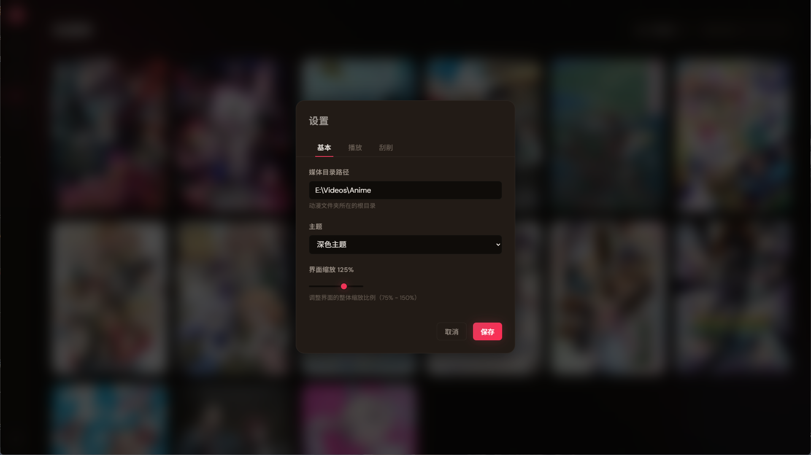
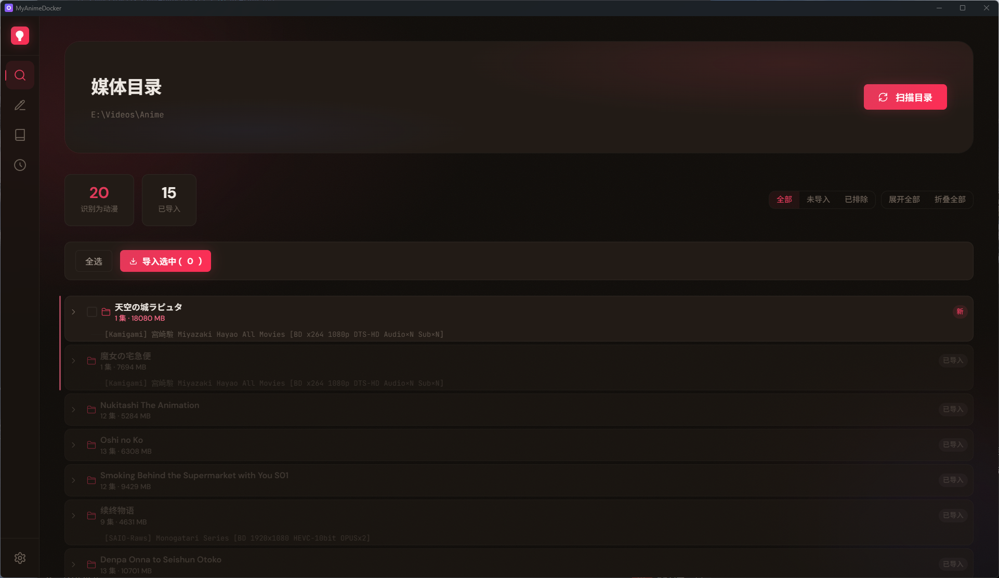
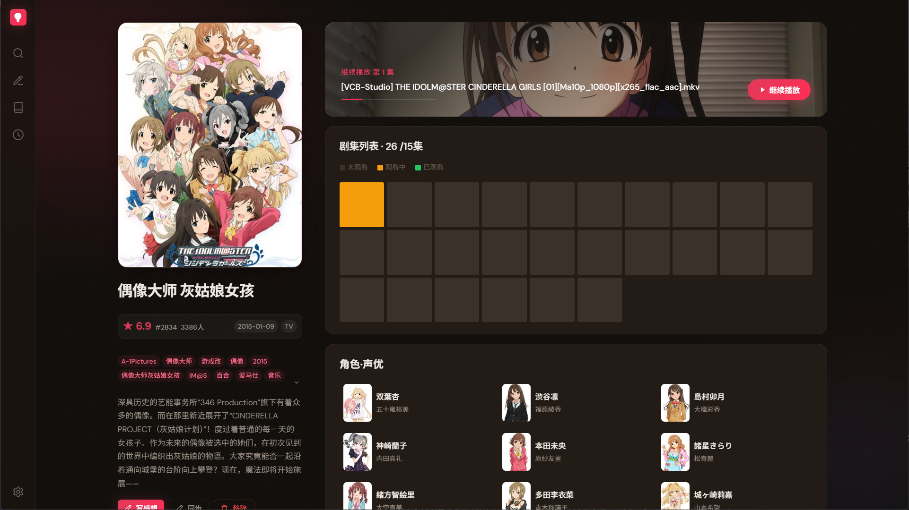

# MyAnimeDocker

自托管动漫媒体库管理器。把散落各处的本地动漫文件统一管理，自动获取封面、简介、评分等元数据，追踪每一集的观看进度，看完后归档留念。

**无论你从哪里下载、文件夹怎么命名，丢进来就好。**

<table>
<tr>
<td align="center"><b>深色主题</b></td>
<td align="center"><b>浅色主题</b></td>
</tr>
<tr>
<td></td>
<td></td>
</tr>
</table>

---

## 下载安装

从 [Releases](https://github.com/user/MyAnimeDocker/releases) 下载最新安装包，双击 `MyAnimeDocker_1.0.0_x64-setup.exe` 安装，完成后双击桌面图标即可启动。

> 需要 Windows 10 或更高版本（WebView2 运行时已内置）。

---

## 快速上手

启动后你会看到 Tauri 桌面窗口，整个使用流程只需 3 步：

**① 设置媒体目录**

点击左侧边栏的「设置」，在「媒体目录」一栏选择你的动漫文件夹。所有设置（主题、播放器、刮削源、UI 缩放等）都在这个页面调整，无需编辑任何文件。



**② 扫描**

切换到「发现」页面，点击「扫描目录」。程序会自动解析你文件夹里每一部动漫的标题、季度、集数等信息，以卡片列表呈现。



勾选你想导入的条目，点击「导入」，动漫就进入资料库了。

**③ 浏览和观看**

切换到「动漫库」，你的收藏以卡片墙展示。点击任意封面进入详情页，查看简介、评分、角色信息，继续播放或追踪观看进度。



就这么简单。以下是对每个页面的详细介绍。

---

## 功能详解

### 发现页 — 扫描与导入

点击「扫描目录」，程序会递归遍历你配置的媒体文件夹，自动解析每个子文件夹的名称——无论它是 `[字幕组] 标题 S01`、`标题/Season 1` 还是其他常见格式。

扫描结果以**扁平卡片列表**呈现，同一父目录下的动漫会用左侧竖线分组，一目了然。每张卡片显示：

- **标题** — anitomy 智能解析（支持中日英），解析失败时自动回退正则清洗
- **季度** — 自动识别 `S01`、`Season 2` 等标记
- **视频信息** — 集数、总大小
- **元数据状态** — 是否已匹配 Bangumi/AniList，显示评分和简介预览

**操作：**

| 操作 | 说明 |
|------|------|
| 勾选 + 批量导入 | 选中多个候选，一键导入资料库 |
| 取消导入 | 已导入的条目可取消关联，回到候选状态 |
| 排除 | 不想管理的文件夹可标记排除，下次扫描不再显示 |
| 获取元数据 | 手动触发单条 Bangumi/AniList 搜索 |
| 重新扫描 | 更新文件夹内容后刷新列表 |

---

### 匹配页 — MetaMatch 批量元数据工作台

导入资料库后，部分动漫可能缺少元数据（封面、简介、评分等）。MetaMatch 提供一个专门的工作台来批量处理这些匹配任务。

**界面结构：**

- **左侧列表** — 显示资料库中所有动漫，按匹配状态分组（待匹配 / 已匹配 / 失败）
- **右侧面板** — 选中条目后显示详细元数据（封面、简介、评分、季度关系）
- **底部批量操作栏** — 勾选多个条目，一键同步

**核心能力：**

- **批量同步** — 点击后服务器逐条搜索元数据并实时推送进度，无需等待全部完成
- **支持取消** — 进行中可随时取消，已匹配的数据保留
- **重试失败项** — 网络问题导致的失败可单独重试
- **手动修正** — 自动匹配不准时，可手动输入关键词重新搜索
- **季度关系** — 自动识别当前是第几季、共几季（基于 AniList 关系数据）

---

### 动漫库 — 你的收藏展示墙

导入并匹配元数据后，所有动漫以**瀑布流卡片网格**呈现在资料库页面。

每张卡片包含：封面图、标题（中文/日文）、评分、季度标签。支持：

- **搜索** — 中文、日文、拼音均可搜索，实时过滤
- **排序** — 按添加时间、评分、名称等排序
- **缩放** — 滑动鼠标滚轮调整卡片大小（50%–200%），记忆上次设置

---

### 详情页 — 深入了解每一部番

详情页是信息最丰富的地方，分为左侧英雄区和右侧三个功能模块。

**左侧英雄区：**

- 大尺寸封面图（从资料库网格点击时有 Flip 飞入动画）
- 标题（中文 + 日文）、评分、季度信息
- 简介文本（支持展开/折叠）
- 标签列表（类型、制作委员会等，超出可折叠）
- 角色卡片网格（头像 + 名字，3 列布局，超出可折叠）

**右侧三个模块：**

| 模块 | 内容 |
|------|------|
| 继续播放 | 显示上次观看的集数和进度，一键继续 |
| 剧集热力图 | 10 列色块网格，直观显示每集观看状态（未看/观看中/已看），点击可直接播放 |
| 观看统计 | 柱状图，展示最近 90 天的观看时长分布 |

**导航：**

- 左右边缘热区显示箭头，点击或键盘 ← → 切换动漫
- 顶部 ✕ 图标点击返回动漫库
- 动画期间自动锁定导航，防止重复点击

---

### 归档页 — 看完的番纪念册

看完一部番后，从资料库删除时会自动归档。归档保留封面、评分和个人感想，以与资料库一致的卡片网格展示。

- **个人评分** — 1-10 分
- **感想笔记** — 自由记录观后感
- **观看日期** — 自动记录归档时间
- **统计栏** — 显示总数和平均评分

---

### 设置页

| 设置 | 说明 |
|------|------|
| 媒体目录 | 选择你的动漫文件夹路径 |
| 播放器 | 系统默认播放器或 mpv（自动追踪进度） |
| 主题 | 深色 / 浅色 |
| UI 缩放 | 75% – 150%，实时预览 |
| 刮削源 | 启用/禁用 Bangumi、TMDB，配置 API Key |

---

## 媒体文件夹结构

每个动漫放在独立子文件夹中，程序会自动解析标题、季度和字幕组信息。

```
media/
├── [SubGroup] Anime Title/
├── [VCB-Studio] Another Title S2 [Ma10p_1080p]/
└── Some Anime/Season 1/
```

- 文件夹名支持 `[字幕组] 标题 S01`、`标题/Season 1` 等多种常见格式
- anitomy 解析 + 正则兜底，中英文均支持

---

## 开发者文档

> 以下内容面向开发者和贡献者。

### 环境要求

- Node.js 18+、npm
- 可选：ffmpeg（视频缩略图）、mpv（播放进度追踪）
- 构建安装包需要：Rust MSVC 工具链 + Visual Studio C++ 生成工具

### 从源码启动

```bash
npm install
cd server && npm install && cd ..
npm run dev:server
```

打开 `http://localhost:3456` 访问。

Tauri 桌面窗口开发模式：

```bash
npm run dev:server:watch  # 终端 1
npm run dev:tauri         # 终端 2
```

Windows 快捷菜单：`start.bat`

### 构建安装包

```bash
npm run build
```

自动执行：pkg 打包 sidecar → 复制原生模块 → Tauri 构建 MSI + NSIS。

输出到 `src-tauri/target/release/bundle/`。

### API 接口

| 方法 | 路径 | 说明 |
|------|------|------|
| GET | `/api/config` | 获取配置 (+ dirValid) |
| POST | `/api/config` | 更新配置 |
| GET | `/api/browse?showExcluded` | 列出扫描树（扁平 leaf） |
| GET | `/api/scan` | SSE 扫描进度 |
| POST | `/api/import` | 导入选中项目 |
| POST | `/api/discovery/unlink` | 从资料库移除，保留扫描树 |
| POST | `/api/discovery/exclude` | 标记排除扫描 |
| POST | `/api/discovery/include` | 取消排除 |
| POST | `/api/discovery/fetch-meta` | 获取元数据 (Bangumi/TMDB) |
| GET | `/api/library` | 获取资料库列表 |
| GET | `/api/anime/:id` | 获取动漫详情 |
| DELETE | `/api/anime/:id` | 删除动漫（归档到记忆） |
| GET | `/api/anime/:id/sessions` | 观看统计 (90 天) |
| POST | `/api/play` | 播放剧集 |
| POST | `/api/progress` | 更新播放进度 |
| POST | `/api/bangumi/search` | 搜索所有启用的刮削源 |
| POST | `/api/bangumi/fetch` | 为资料库项目获取元数据 |
| GET | `/api/mpv-status` | 活跃 mpv 会话 |
| POST | `/api/quit` | 关闭服务器 |
| GET | `/api/health` | Tauri 就绪检测 |
| GET | `/api/thumbnail?path=&time` | 视频缩略图 (ffmpeg) |
| GET | `/covers/xxx.jpg?w=&q=` | 动态封面缩放 (ffmpeg) |
| POST | `/api/library/sync` | 批量元数据同步 (JSON) |
| GET | `/api/library/sync/stream` | SSE 批量同步 (流式，支持取消) |
| GET | `/api/memories` | 获取观看历史 |
| POST | `/api/memories` | 创建/更新记忆 |

### 技术栈

- **后端**: Node.js（无框架，原生 `http.createServer`）
- **前端**: 原生 HTML/CSS/JS（无构建工具，无框架）
- **动画**: GSAP + Flip 插件
- **图片处理**: ffmpeg（实时缩放 + 缓存）
- **元数据**: Bangumi API + AniList GraphQL + TMDB API（多源刮削架构）
- **播放器**: mpv（`spawn` + `--term-status-msg` 进度追踪）
- **存储**: SQLite（Prisma ORM）+ JSON 双写
- **桌面壳**: Tauri v2（Rust, sidecar 模式）
- **解析**: anitomy（TypeScript 移植版，纯 JS）

### 项目结构

```
├── server/            → Node.js 后端 (sidecar)
│   ├── server.js      → HTTP server + REST API (:3456)
│   ├── db.js          → Prisma 封装层
│   ├── scanner.js     → 媒体目录扫描 + anitomy 解析
│   ├── mpv-controller.js → mpv 进度追踪
│   ├── logger.js      → 结构化日志
│   ├── scrapers/      → 多源刮削（bangumi, anilist, tmdb）
│   └── package.json   → Sidecar 依赖
├── src-tauri/         → Tauri v2 桌面壳 (Rust)
├── prisma/            → SQLite schema + migrations
├── public/            → 前端静态文件
├── scripts/           → 构建/迁移工具
└── start.bat          → Windows 快捷菜单
```

### 数据存储

| 层级 | 存储 | 说明 |
|------|------|------|
| 资料库 | SQLite (Anime + Episode) | 当前下载、正在观看 |
| 归档 | SQLite (Memory) | 已看完纪念册 |
| 配置 | JSON (config.json) | 通过设置页 UI 管理 |
| 扫描树 | JSON (anime-data.json) | 运行时缓存 |

**持久化策略**：`saveData()` 同步写入 JSON（立即落盘），异步同步到 SQLite（副本保证）。

## License

ISC

