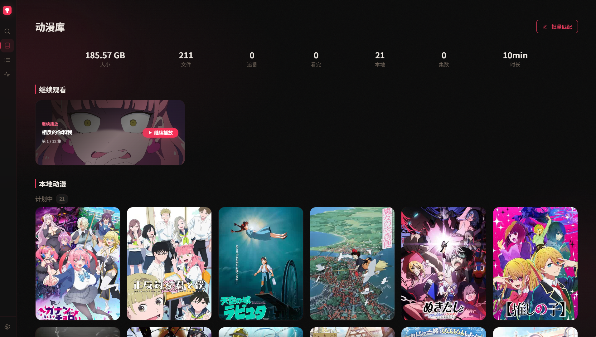
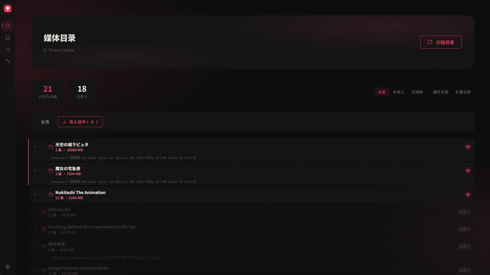
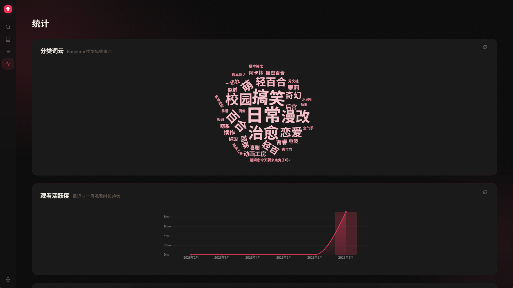

<h1 align="center">MyAnimeDocker</h1>

<p align="center">
  <b>本地优先的动漫收藏管理工具</b><br>
  智能扫描文件夹、Bangumi 元数据匹配、mpv 进度追踪，全在本地 SQLite 数据库。
</p>

<div align="center">


</div>

<p align="center">
🇨🇳 <a href="./README.new.md">简体中文</a> | 🇺🇸 <a href="./README.en.new.md">English</a>
</p>

---

## 目录

- [简介](#简介)
- [设计思路](#设计思路)
- [功能特性](#功能特性)
- [快速开始](#快速开始)
- [典型工作流](#典型工作流)
- [配置说明](#配置说明)
- [技术栈](#技术栈)
- [项目结构](#项目结构)
- [开发指南](#开发指南)
- [构建与分发](#构建与分发)
- [许可证](#许可证)

---

## 简介

**MyAnimeDocker** 是一款以 Windows 为主力的本地动漫媒体库管理器。它面向既有追新番习惯、也常下载补档的动漫爱好者，提供从文件入库到完结记录的全周期管理。

你只需将动漫文件夹交给它，MyAnimeDocker 会完成剩余工作：自动扫描视频文件、使用 [anitomy](https://github.com/Scinath/node-anitomy) 解析标题与季度、从 [Bangumi](https://bgm.tv) 拉取元数据（封面、简介、评分、角色信息）、通过 mpv 播放器追踪每集进度，并在完结时记录评分与感想。

> [!IMPORTANT]
> **需要 [mpv](https://mpv.io) 播放器**。MyAnimeDocker 本身不含播放器，需自行安装 mpv。推荐 [hooke007/MPV_lazy](https://github.com/hooke007/MPV_lazy) Windows 整合包，开箱即用。
>
> 所有数据（资料库、播放记录、配置）全部存储在本地 SQLite 数据库中，不依赖任何外部云服务。桌面壳基于 Tauri v2（Rust sidecar），当前仅支持 Windows 10+。



---

## 设计思路

市面上的动漫管理工具要么过于臃肿，要么深度依赖在线服务。MyAnimeDocker 围绕以下原则设计：

| 原则 | 说明 |
|------|------|
| **本地优先** | 数据全部留在本地 SQLite，无需注册账号，不依赖云同步 |
| **播放器中转站** | 我们只负责启动播放器并通过 IPC 追踪进度，播放体验完全由播放器本身决定 |
| **零配置解析** | 把动漫文件夹丢进去，自动识别标题、季度、字幕组，不挑命名格式 |
| **全生命周期覆盖** | 从扫描入库、元数据匹配，到观看追踪、状态管理，一个工具走完 |
| **单机体验优先** | 桌面原生应用，没有 Web 服务的部署负担，没有 bundler 的构建等待 |

---

## 功能特性

### 📁 智能扫描

递归遍历媒体目录，自动识别视频文件（`.mkv` / `.mp4` / `.avi` / `.mov` / `.webm`），使用 anitomy 解析文件夹名提取标题、季度、字幕组。支持常见命名格式：

```
[SubGroup] Anime Title S01
Anime Title/Season 1
[VCB-Studio] Another Title [Ma10p_1080p]
```

解析失败时自动回退正则清洗，NCOP/NCED/PV 等非正片视频自动排除。

文件夹名包含 `[bgmN]` 格式数字 ID 时，自动精准匹配 Bangumi 条目，无需手动搜索。



### 🏷️ 元数据匹配

- 从 Bangumi API 自动获取封面、简介、评分、标签、角色声优信息
- **批量匹配工作台**：列表 + 滑入面板布局，SSE 流式同步实时显示进度，支持取消和重试
- Sorensen-Dice 模糊匹配算法自动关联本地文件与 Bangumi 条目
- AniList GraphQL 辅助提取罗马音标题和季度链

### 🏠 资料库主页（Library Dashboard）

资料库是应用的默认启动视图，顶部为 Dashboard 面板，下方为按状态分组的动漫网格：

**统计概览** — 一行展示 6 项汇总数据：总文件大小、文件数、追番中、已看完、本地总数、已看集数、观看时长。

**继续观看** — 横向可滚动卡片列表，展示进度未完成的动漫（最多 10 部），按最近活动排序。每张卡片显示：
- 视频缩略图（ffmpeg 生成，取播放进度位置）、剧集标题
- 下一集索引 / 总集数
- 「继续播放」按钮，点击直接跳转详情页并开始播放

**本地动漫** — 按 MyList 状态分三组以卡片网格展示：
| 分组 | 说明 |
|------|------|
| 进行中（watching） | 正在追的番剧 |
| 计划中（wish） | 待看的番剧 |
| 已完成（completed） | 已看完的番剧 |

每组带标题和计数，超出可视区域的卡片以淡入动画渐显。卡片支持右键菜单（复制标题、打开 Bangumi、标记状态、删除）。

### ▶️ mpv 播放与进度追踪

在设置页中配置 mpv 可执行文件路径即可使用。我们仅负责启动 mpv 并通过 IPC 追踪进度，播放体验（渲染、着色器、补帧、字幕样式等）完全由 mpv 自身决定。

播放与进度追踪功能：
- 通过 `--input-ipc-server` IPC 管道实时追踪播放进度
- 每 10 秒自动将进度写入 SQLite，mpv 关闭时最终落盘
- 播放第 N 集时自动标记前 N-1 集为已看
- 支持从上次进度继续播放
- 服务器内存维护 `activePlays` Map 追踪活跃会话

### 📋 MyList — 状态管理总览

MyList 是独立的完整管理视图，覆盖动漫消费周期的所有状态流转：

```
导入 ──→ watching（进行中）──→ 看完 ──→ completed（已完成）
                                            │
                                      可选 ──→ 删除
```

**视图与交互**：

- **Tab 筛选**：顶部 Tab 栏支持按状态筛选（全部 / 进行中 / 计划中 / 已完成 / 搁置 / 抛弃），卡片网格实时过滤
- **全览模式**：默认展示全部条目，按状态分组排列（进行中 → 计划中 → 已完成 → 搁置 → 抛弃），每组带标题和计数
- **卡片交互**：资料库条目点击跳转详情页（GSAP Flip 封面动画）；纯愿望单条目弹出详情弹窗，直连 Bangumi 页面
- **右键菜单**：复制标题、在 Bangumi 中打开、标记状态、从列表移除

**状态编辑弹窗**：

点击卡片上的状态标记按钮，弹出完整编辑面板：
- **状态选择**：自定义下拉菜单切换 5 种状态
- **评分**：数字步进器（0–10，0.5 步进）
- **观看进度**：数字步进器（已看集数）
- **起止日期**：三段式输入（年/月/日），自动跳格
- **笔记**：自由文本框
- 保存后自动同步 MyList 及资料库

**完结记录**：
`completed` 条目支持弹窗填写评分、感想和详细笔记，保存后持久化。

### 📈 统计看板（Stats 页）

独立的可视化分析页面，包含四张 D3.js + WordCloud 图表：

| 图表 | 数据源 | 说明 |
|------|--------|------|
| **标签词云** | `/api/stats/tags` | Bangumi 标签词频，最多 60 个词，按权重渲染 |
| **观看活跃度** | `/api/stats/watch-activity` | 面积图 + 条形图叠加，月度观看时长，hover 显示小时数 |
| **评分分布** | `/api/stats/ratings` | 直方图，评分区间统计条目数和占比 |
| **季度分布** | `/api/stats/seasons` | 横向条形图，春夏秋冬分布，底部标注未知季度 |

图表自动适配深色/浅色模式及当前色彩主题，切换时自动重绘。



### 🎨 主题系统

6 种色彩主题 + 独立深色/浅色模式，底部 Dock 切换即时生效：

| 主题 | 色值 |
|------|------|
| default（玫红） | 玫瑰红主色调 |
| amber（琥珀） | 暖橙琥珀色 |
| ocean（海洋） | 蓝青色海洋系 |
| sakura（樱花） | 粉紫樱花系 |
| emerald（翡翠） | 绿松石翡翠系 |
| violet（紫罗兰） | 紫罗兰色系 |

### 🔄 Bangumi OAuth 双向同步

- OAuth 授权登录，Pull（拉取收藏列表）→ Merge（合并本地数据）→ Push（推送到 Bangumi）
- 全量同步，每次操作自动同步状态变更

### 🚀 启动自动导入

服务器启动时异步扫描有 `[bgmN]` 标识的新文件夹，自动完成导入全流程。

### 🔍 拼音搜索

前端同时匹配 `title` / `bangumiTitle` / `pinyinTitle`，支持拼音搜索（全拼匹配，不分声调）。

---

## 快速开始

### 安装（推荐）

从 [Releases](https://github.com/user/MyAnimeDocker/releases) 下载 MSI 或 NSIS 安装包，双击安装。需要 Windows 10+（WebView2 已内置）。

### 从源码运行

```bash
# 前置要求：Node.js 18+、Rust MSVC toolchain、mpv（仅支持 mpv）
git clone https://github.com/user/MyAnimeDocker.git
cd MyAnimeDocker
npm install
cd server && npm install && cd ..
npm run prisma:generate
```

```bash
# 启动开发模式
npm run dev:server:watch   # 终端 1：后端（nodemon 自动重启）
npm run dev:tauri           # 终端 2：Tauri 窗口
# 或单条命令同时启动
npm run dev
```

---

## 典型工作流

### 从下载到完结记录

```
下载文件 ──→ 设置媒体目录 ──→ 扫描 ──→ 导入 ──→ 元数据匹配 ──→ 观看 ──→ 完结
```

**第一步：设置媒体目录**

打开设置页，选择你的动漫根目录。支持多层嵌套的文件夹结构。

**第二步：扫描**

切换到「发现」页面，点击扫描目录。程序以扁平卡片列表展示所有包含视频的文件夹，每张卡片显示标题、季度、文件数量和大小。

已导入的条目自动标记 `alreadyImported`，已排除的标记 `excluded`，不会重复操作。

**第三步：导入**

勾选需要入库的条目，点击导入。系统自动创建资料库记录和 MyList 条目（默认状态 `watching`）。

**第四步：元数据匹配**

导入后自动开始元数据匹配。可在批量匹配工作台中查看进度、手动修正或重试失败条目。

**第五步：观看**

点击动漫封面进入详情页，查看完整元数据（封面、简介、评分、角色声优），选择剧集通过 mpv 播放。

播放进度自动追踪，关闭 mpv 时进度自动写入。每集剧集卡片显示观看状态（橙色 = 进行中，绿色 = 已完成）。

**第六步：完结**

看完后 MyList 状态自动切换为 `completed`，可在此撰写评分和笔记。已完结条目可选从资料库删除以保持库的整洁，MyList 中的观看记录保留。

---

## 配置说明

### 配置文件

以下文件位于服务器数据目录下（开发模式在 `server/`，生产模式在 `%APPDATA%/com.myanimedocker.app/`）：

| 文件 | 说明 |
|------|------|
| `config.json` | 用户配置（可通过设置页修改） |
| `anime.db` | SQLite 数据库（Prisma ORM） |
| `scanned-tree.json` | 扫描树缓存（JSON） |
| `covers/` | 封面图片缓存 |
| `thumbs/` | 视频缩略图缓存 |

### 配置项

```json
{
  "mediaDir": "D:/Media/Anime",
  "playerMode": "mpv",
  "mpvPath": "mpv",
  "theme": "ocean",
  "themeMode": "dark",
  "autoMarkWatched": true,
  "reduceMotion": false,
  "uiScale": 1.25,
  "apiSources": [
    { "type": "bangumi", "url": "https://api.bangumi.lol", "key": "" }
  ]
}
```

| 字段 | 类型 | 默认值 | 说明 |
|------|------|--------|------|
| `mediaDir` | string | `""` | 动漫文件夹根目录 |
| `playerMode` | string | `"mpv"` | 播放器模式（固定 mpv，暂不支持其他播放器） |
| `mpvPath` | string | `"mpv"` | mpv 可执行文件路径或命令名 |
| `theme` | string | `"default"` | 色彩主题 |
| `themeMode` | string | `"dark"` | 深色/浅色模式 |
| `autoMarkWatched` | bool | `true` | 播放完成后自动标记已看 |
| `reduceMotion` | bool | `false` | 减少动画效果 |
| `uiScale` | number | `1.25` | UI 缩放倍数（前端以 % 显示，范围 75–150） |
| `apiSources` | array | `[{...}]` | 元数据源列表（type/url/key） |

### 媒体文件夹结构

```
media/
├── [SubGroup] Anime Title/
├── [VCB-Studio] Another Title S2 [Ma10p_1080p]/
├── Anime Title [bgm12345]/
└── Some Title/Season 1/
```

文件夹嵌套深度不限，Leaf 节点（直接包含视频的文件夹）被识别为独立条目。

---

## 技术栈

| 层 | 技术 |
|------|------|
| **后端** | Node.js（原生 `http` 模块，无框架） |
| **前端** | Vanilla HTML / CSS / JavaScript（无 bundler） |
| **桌面壳** | Tauri v2（Rust） |
| **数据库** | SQLite（Prisma ORM） |
| **动画** | GSAP + Flip 插件 |
| **播放器** | mpv（spawn + IPC 进度追踪） |
| **元数据** | Bangumi API + AniList GraphQL（罗马音辅助） |
| **解析** | anitomy（TypeScript 移植版） |
| **可视化** | D3.js + wordcloud2.js |
| **搜索** | pinyin npm 包（拼音转写） |
| **构建** | pkg（Node.js 侧车打包）|

---

## 项目结构

```
MyAnimeDocker/
├── server/                      # Node.js 后端（Tauri sidecar）
│   ├── server.js                # HTTP 服务器 + REST API（:3456）
│   ├── db.js                    # Prisma/SQLite 数据层封装
│   ├── scanner.js               # 媒体扫描器（anitomy）
│   ├── mpv-controller.js        # mpv IPC 进度追踪
│   ├── logger.js                # 结构化日志（[TAG] 前缀）
│   ├── bangumi-sync.js          # Bangumi OAuth 同步编排
│   ├── config.example.json      # 配置模板
│   ├── scrapers/                # 元数据刮削器
│   │   ├── index.js             # 注册中心、批量搜索、模糊匹配
│   │   ├── bangumi.js           # Bangumi API
│   │   ├── bangumi-personal.js  # Bangumi OAuth 收藏管理
│   │   ├── anilist.js           # AniList GraphQL

│   └── __tests__/               # 集成测试（17 tests）
├── public/                      # 前端静态文件
│   ├── index.html               # 入口
│   ├── styles.css               # 全局样式 + 6 色彩主题
│   └── js/
│       ├── api.js               # fetch() 封装
│       ├── app.js               # 路由、主题、设置、缩放
│       ├── library.js           # 资料库网格视图
│       ├── discovery.js         # 发现/扫描视图
│       ├── detail.js            # 详情页（GSAP Flip 动画）
│       ├── detail-stats.js      # 详情页图表
│       ├── detail-nav.js        # 详情页导航
│       ├── mylist.js            # MyList 全生命周期总览（状态管理/评分/进度/日期/笔记）
│       ├── memory.js            # 完结条目评分/感想弹窗（MyList + 详情页）
│       ├── stats.js             # 统计看板（词云 + D3 活跃度/评分/季度图表）
│       ├── metamatch.js         # 批量元数据匹配工作台
│       ├── state.js             # 前端状态管理
│       ├── ui.js                # UI 工具函数
│       ├── utils.js             # 通用工具函数
│       └── debug.js             # 前端诊断系统
├── src-tauri/                   # Tauri v2 桌面壳（Rust）
│   ├── src/main.rs              # sidecar 管理 + 窗口
│   ├── Cargo.toml               # Rust 依赖
│   ├── tauri.conf.json          # 窗口/权限/外部二进制配置
│   └── capabilities/            # v2 权限声明
├── prisma/                      # 数据库 schema + 迁移
│   ├── schema.prisma            # 数据模型定义
│   └── migrations/              # 迁移历史
└── scripts/
    └── copy-sidecar-deps.js     # pkg 构建后复制原生模块
```

### 数据模型

| 表 | 说明 | 关键字段 |
|------|------|------|
| `Anime` | 动漫条目 | id, folderPath, title, bangumiId, bangumiTitle, summary, coverUrl, rating, pinyinTitle |
| `Episode` | 剧集 | animeId, number, filePath, duration, watched, progress |
| `PlaySession` | 播放会话 | animeId, episodeNumber, startTime, endTime, duration, clockTime |
| `MyList` | 观看状态 | animeId, bangumiId, status, rating, thoughts, startedAt, completedAt, progress |
| `ScannedTree` | 扫描树缓存 | JSON 字符串（扁平 leaf 数组） |
| `Config` | 配置缓存 | JSON 字符串 |

---

## 开发指南

### 验证层级

| 层级 | 命令 | 耗时 | 说明 |
|------|------|------|------|
| Tier 0 | `npm run check:rust` | ~20s | Rust 类型检查（`cargo check`） |
| Tier 1 | `npm run dev:server:watch` | 秒级 | JS 改动即时重启 |
| Tier 2 | `npm run dev:prod` | ~1min | 生产流程模拟（sidecar 自启） |
| Tier 3 | `npm run build` | ~5min | 最终打包 |

### 常用命令

```bash
npm run dev                  # 同时启动后端 + Tauri
npm run dev:server           # 仅启动后端（node server/server.js）
npm run dev:server:watch     # 后端 + nodemon 自动重启
npm run dev:tauri            # 仅启动 Tauri 开发窗口
npm run prisma:generate      # 重新生成 Prisma 客户端
npm run prisma:migrate       # 创建/应用数据库迁移
npm run prisma:studio        # 打开 Prisma Studio（SQLite 浏览器）
cd server && npm test        # 运行集成测试（17 tests）
```

### 前端约定

- `camelCase` 命名，2 空格缩进
- 默认启动视图为资料库（library）
- HTML 事件用 `onclick` 属性（动态渲染场景用 `addEventListener`）
- GSAP 已注册全局 `gsap.registerPlugin(Flip)`
- CSS 缩放使用 `--scale` CSS 自定义属性，**禁止使用 CSS `zoom`**
- 操作 DOM 前检查元素存在性（非当前页面时 `getElementById` 返回 null）

### 调试

前端内置诊断系统：F12 打开控制台，执行 `__debug.toggle()` 开启日志输出，用于追踪视图切换、滚动位置、数据加载等状态。

```js
__debug.toggle()              // 启用/关闭日志
__debug.log(tag, ...args)     // 带标签的日志输出
__debug.snapshot(label)       // 快照：view, scrollTop, 数据长度等
```

### 数据持久化机制

```
用户操作 → API 端点 → 细粒度写入对应 SQLite 表 → db.js 封装
                ↓
         JSON 文件（scannedTree、config 为独立 JSON）
```

每个 API 端点只写入实际修改的表（`saveLibrary()` / `saveMyList()` / `savePlaySessions()` / `updateEpisodeProgress()`），避免全量 `saveData()` 导致 nodemon 误重启。

> [!IMPORTANT]
> 开发模式 DATA_DIR = `server/`，生产模式 DATA_DIR = `%APPDATA%/com.myanimedocker.app`。Prisma 引擎路径通过 `PRISMA_QUERY_ENGINE_LIBRARY` 环境变量指定。

---

## 构建与分发

```bash
# 完整构建（pkg sidecar + Tauri MSI/NSIS）
npm run build

# 仅 MSI 安装器
npm run build:msi

# 仅 NSIS 安装器
npm run build:nsis

# 仅构建 sidecar 可执行文件
npm run build:server

# 快速构建 EXE（无安装器，~1 分钟）
npm run build:exe
```

### 构建产物

| 产物 | 路径 |
|------|------|
| Node.js sidecar | `src-tauri/server-x86_64-pc-windows-msvc.exe` |
| Tauri EXE | `src-tauri/target/release/myanimedocker.exe` |
| MSI 安装器 | `src-tauri/target/release/bundle/msi/` |
| NSIS 安装器 | `src-tauri/target/release/bundle/nsis/` |

> [!WARNING]
> 构建缓存 `src-tauri/target/` 可达 5GB+，可安全删除后重新构建。

---

## 许可证

[ISC](LICENSE)

---

<p align="center">
  <sub>Built by <a href="https://github.com/ScarletFish">ScarletFish</a></sub>
</p>
